# Common Usage and Example
- Architecture: C4 modelling, AWS, Azure, kubernetes, Elastics
- Programming: class, sequence, activity, parallel processing, state machine, process timeline, swagger open API  
- Build & Configuration: cargo, gradle, terraform, ansible
- Network: DNS, trace route, Firewall, routing, apache log, gpg/pgp, sitemap, isp mapper, tcpdump
- Data translation: json, db schema, Text read stdin, xml sql
- AI: keras neural network, Word formation, Topic extraction
- Profiler
- Knowledge map
- Domain storytelling
- Org chart WBS
- Gantt chart
- Material design icon
- Directed/ undirected graph, Mindmap

# Sequence 
- used for complex flow on calling external system
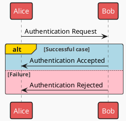

# Class 
- used for design pattern
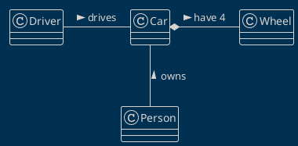

# Activity / Workflow 
- used for complex workflow 
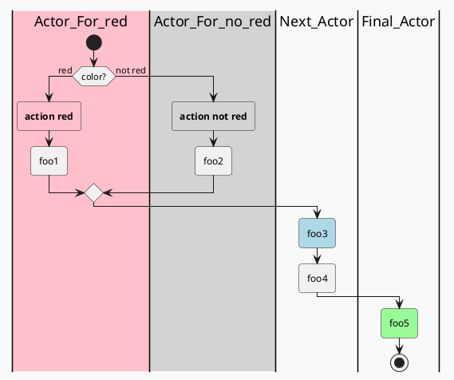

# Parallel Processing
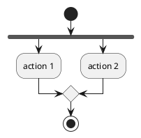

# State Machine
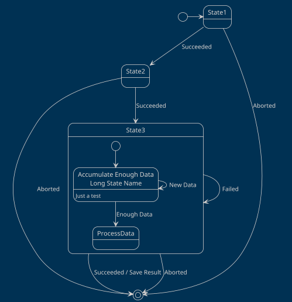

# Timeline
- used to show lead time on each process
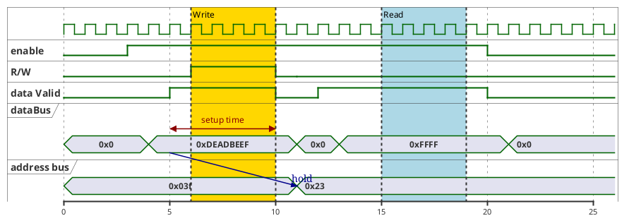
# Network 
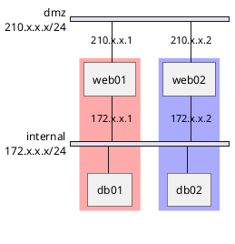

# JSON Specification

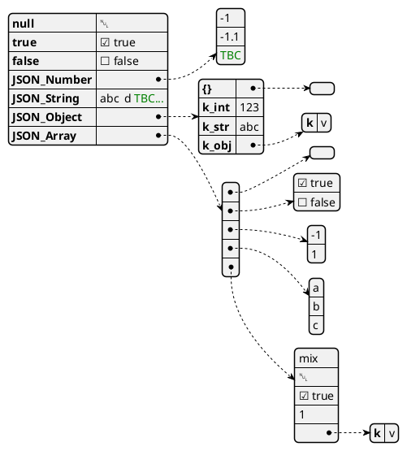

# DITAA - DIagrams Through Ascii Art
- [more ditaa example](http://ditaa.sourceforge.net/#usage)
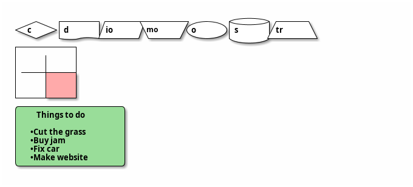

# Gantt Chart
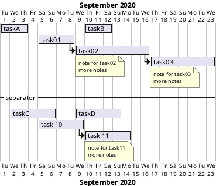
# Mindmap
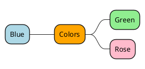

# Org Chart / WBS
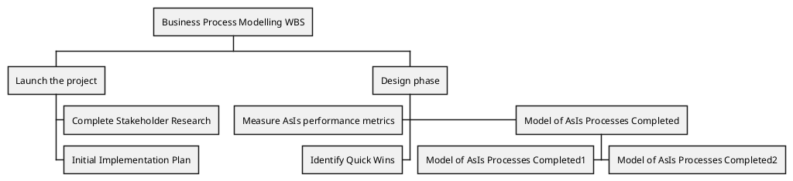

# Amazon Labs AWS  
```plantuml
@startuml
'Copyright 2019 Amazon.com, Inc. or its affiliates. All Rights Reserved.
'SPDX-License-Identifier: MIT (For details, see https://github.com/awslabs/aws-icons-for-plantuml/blob/master/LICENSE)

!include <awslib/AWSCommon>

' Uncomment the following line to create simplified view
' !include <awslib/AWSSimplified>

!include <awslib/General/Users>
!include <awslib/Mobile/APIGateway>
!include <awslib/SecurityIdentityAndCompliance/Cognito>
!include <awslib/Compute/Lambda>
!include <awslib/Database/DynamoDB>

left to right direction

Users(sources, "Events", "millions of users")
APIGateway(votingAPI, "Voting API", "user votes")
Cognito(userAuth, "User Authentication", "jwt to submit votes")
Lambda(generateToken, "User Credentials", "return jwt")
Lambda(recordVote, "Record Vote", "enter or update vote per user")
DynamoDB(voteDb, "Vote Database", "one entry per user")

sources --> userAuth
sources --> votingAPI
userAuth <--> generateToken
votingAPI --> recordVote
recordVote --> voteDb
@enduml
```

# Azure Cloud
```plantuml
@startuml
!include <azure/AzureCommon>
!include <azure/Analytics/AzureEventHub>
!include <azure/Analytics/AzureStreamAnalytics>
!include <azure/Databases/AzureCosmosDb>

left to right direction

agent "Device Simulator" as devices #fff

AzureEventHub(fareDataEventHub, "Fare Data", "PK: Medallion HackLicense VendorId; 3 TUs")
AzureEventHub(tripDataEventHub, "Trip Data", "PK: Medallion HackLicense VendorId; 3 TUs")
AzureStreamAnalytics(streamAnalytics, "Stream Processing", "6 SUs")
AzureCosmosDb(outputCosmosDb, "Output Database", "1,000 RUs")

devices --> fareDataEventHub
devices --> tripDataEventHub
fareDataEventHub --> streamAnalytics
tripDataEventHub --> streamAnalytics
streamAnalytics --> outputCosmosDb
@enduml

```

# Elastic Search - ELK
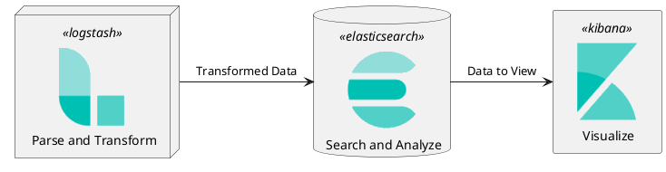

# Kubernetes
- [more k8s example](https://github.com/dcasati/kubernetes-PlantUML)
```plantuml
@startuml kubernetes

footer Kubernetes Plant-UML
scale max 1024 width

skinparam nodesep 10
skinparam ranksep 10

' Azure
!define AzurePuml https://raw.githubusercontent.com/RicardoNiepel/Azure-PlantUML/release/2-1/dist

!includeurl AzurePuml/AzureCommon.puml
!includeurl AzurePuml/AzureSimplified.puml

!includeurl AzurePuml/Containers/AzureContainerRegistry.puml
!includeurl AzurePuml/Databases/AzureCosmosDb.puml
!includeurl AzurePuml/Databases/AzureSqlDatabase.puml
!includeurl AzurePuml/DevOps/AzurePipelines.puml
!includeurl AzurePuml/Identity/AzureActiveDirectory.puml
!includeurl AzurePuml/Networking/AzureLoadBalancer.puml
!includeurl AzurePuml/Security/AzureKeyVault.puml

' Kubernetes
!define KubernetesPuml https://raw.githubusercontent.com/dcasati/kubernetes-PlantUML/master/dist

!includeurl KubernetesPuml/kubernetes_Common.puml
!includeurl KubernetesPuml/kubernetes_Context.puml
!includeurl KubernetesPuml/kubernetes_Simplified.puml

!includeurl KubernetesPuml/OSS/KubernetesApi.puml
!includeurl KubernetesPuml/OSS/KubernetesIng.puml
!includeurl KubernetesPuml/OSS/KubernetesPod.puml

actor "DevOps" as devopsAlias
collections "Client Apps" as clientalias
collections "Helm Charts" as helmalias

left to right direction

' Azure Components
AzureActiveDirectory(aad, "\nAzure\nActive Directory", "Global")
AzureContainerRegistry(acr, "ACR", "Canada Central")
AzureCosmosDb(cosmos, "\nCosmos DB", "Global")
AzureKeyVault(keyvault, "\nAzure\nKey Vault", "Global")
AzureLoadBalancer(alb, "\nLoad\nBalancer", "Canada Central")
AzureSqlDatabase(sql, "\nExternal\ndata stores", "Canada Central")
AzurePipelines(ado, "CI/CD\nAzure Pipelines", "Global")

' Kubernetes Components
Cluster_Boundary(cluster, "Kubernetes Cluster") {
    KubernetesApi(KubernetesApi, "Kubernetes API", "")

    Namespace_Boundary(nsFrontEnd, "Front End") {
        KubernetesIng(ingress, "API Gateway", "")
    }

    Namespace_Boundary(nsBackEnd, "Back End") {
        KubernetesPod(KubernetesBE1, "", "")
        KubernetesPod(KubernetesBE2, "", "")
        KubernetesPod(KubernetesBE3, "", "")
    }

    Namespace_Boundary(nsUtil, "Utiliy Services") {
        KubernetesPod(KubernetesUtil1, "", "")
        KubernetesPod(KubernetesUtil2, "","")
    }
}

Rel(devopsAlias, aad, "AUTH")
Rel(helmalias, KubernetesApi, "helm upgrade")

Rel(aad, keyvault, " ")
Rel(KubernetesApi, aad, "RBAC", "ASYNC")

Rel(clientalias, alb, "HTTP", "ASYNC")
Rel(alb, ingress, "HTTP", "ASYNC")

Rel(ingress, KubernetesBE1, " ")
Rel(KubernetesBE1, KubernetesBE2, " ")
Rel(KubernetesBE1, KubernetesBE3, " ")

Rel(KubernetesBE2, sql, " ")
Rel(KubernetesBE3, keyvault, "Pod Identity")
Rel(KubernetesBE3, cosmos, " ")

Rel(ado, acr, "docker push")
Rel_U(KubernetesApi, acr, "docker pull")
@enduml
```

# Domain Storytelling
[ref](https://github.com/johthor/DomainStory-PlantUML)

```plantuml
@startuml
!include https://raw.githubusercontent.com/johthor/DomainStory-PlantUML/main/domainStory.puml
'!include ../domainStory.puml

!include <material/bus>
!unquoted procedure Bus($name, $label = "", $color = "", $scale = "")
    Object("Bus", "$ma_bus", $name, $label, $color, $scale)
!endprocedure

Person(agent, gate agent)
Person(dispatcher ,bus dispatcher)
System(dispatching, bus dispatching)
Person(driver, bus driver)
Group(passengers)

Boundary(contracting) {
    Call(busCall, bus)
    Document(jobOrder, job to order)
    Call(order)
}

Boundary(transport) {
    Bus(bus)
}

Boundary(logging) {
    Document(details1, details of the journey)
    Document(details2, details of the journey)
    Document(details3, details of the journey)
    note right of details1
        Disruptions,
        number of
        passengers
        transported, etc.
    end note
}

activity(_, agent, orders, busCall, from, dispatcher)
activity(_, dispatcher, creates, jobOrder, in, dispatching, <--, -->)
activity(_, dispatcher, gives, order, to, driver)
activity(_, driver, transports by, bus, passengers, _, <--)
activity(_, driver, logs, details1)
activity(_, driver, hands over, details2, at the end of the shift to, dispatcher)
activity(_, dispatcher, enters, details3, in, dispatching, -->, <--)

contracting -[hidden]> transport
@enduml
```

# Material Design Icon
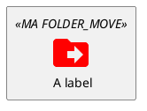

# Directed Graph 
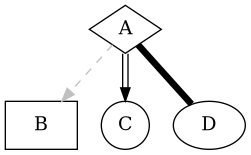
# undirected Graph
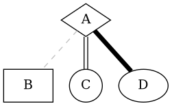

# Maths
$$ \mu = \frac{1}{N} \sum_{i=0} x_i $$

# Theme
[list of official theme](https://the-lum.github.io/puml-themes-gallery/)
[gallery](https://bschwarz.github.io/puml-themes/gallery.html)
1. mars
2. blueprint

