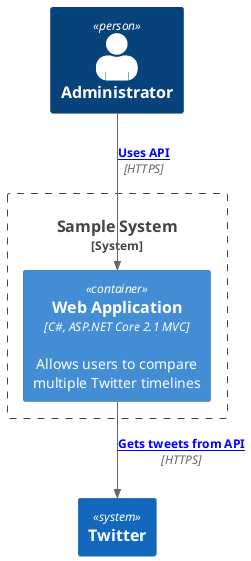
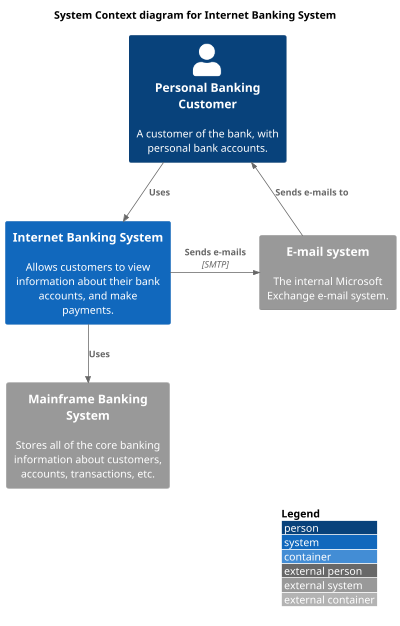
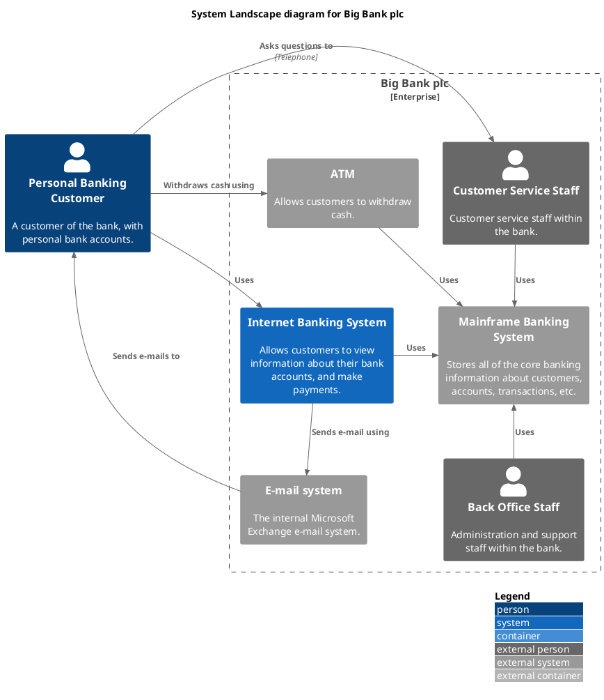
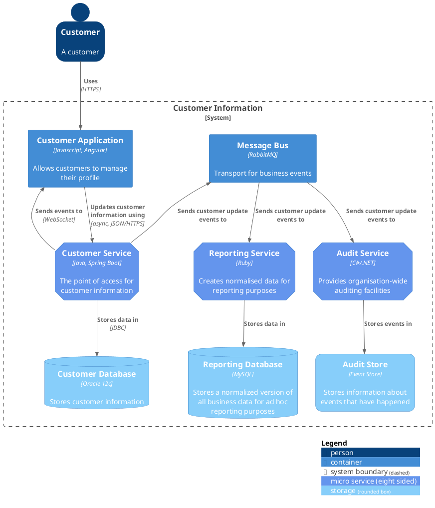

# Plantuml Installation

- `$cargo install mdbook-graphviz`
- `$cargo install mdbook-plantuml` : require to change source code for "graphviz"
- `$brew install graphviz` : current 3.0.0
- `$brew install plantuml` : current 1.2022.5
- for C4, remove any string after @startuml, otherwise mdbook will not render

# install mdbook preprocessor in book.toml
```toml
[preprocessor.plantuml]
plantuml-cmd="/usr/local/bin/plantuml"
```

# Container View 
- sample with links, showing connection protocol between services


# System Context View


# Container View - shows application, service, microservice, etc
```plantuml
@startuml
!include <C4/C4_Container>
!define DEVICONS https://raw.githubusercontent.com/tupadr3/plantuml-icon-font-sprites/master/devicons
!define FONTAWESOME https://raw.githubusercontent.com/tupadr3/plantuml-icon-font-sprites/master/font-awesome-5
' uncomment the following line and comment the first to use locally
' !include C4_Container.puml
!include DEVICONS/angular.puml
!include DEVICONS/dotnet.puml
!include DEVICONS/java.puml
!include DEVICONS/msql_server.puml
!include FONTAWESOME/server.puml
!include FONTAWESOME/envelope.puml

' LAYOUT_TOP_DOWN()
' LAYOUT_AS_SKETCH()
LAYOUT_WITH_LEGEND()

title Container diagram for Internet Banking System

Person(customer, Customer, "A customer of the bank, with personal bank accounts")

System_Boundary(c1, "Internet Banking") {
    Container(web_app, "Web Application", "Java, Spring MVC", "Delivers the static content and the Internet banking SPA", "java")
    Container(spa, "Single-Page App", "JavaScript, Angular", "Provides all the Internet banking functionality to cutomers via their web browser", "angular")
    Container(mobile_app, "Mobile App", "C#, Xamarin", "Provides a limited subset of the Internet banking functionality to customers via their mobile device", "dotnet")
    ContainerDb(database, "Database", "SQL Database", "Stores user registraion information, hased auth credentials, access logs, etc.", "msql_server")
    Container(backend_api, "API Application", "Java, Docker Container", "Provides Internet banking functionality via API", "server")
}

System_Ext(email_system, "E-Mail System", "The internal Microsoft Exchange system", "envelope")
System_Ext(banking_system, "Mainframe Banking System", "Stores all of the core banking information about customers, accounts, transactions, etc.")

Rel(customer, web_app, "Uses", "HTTPS")
Rel(customer, spa, "Uses", "HTTPS")
Rel(customer, mobile_app, "Uses")

Rel_Neighbor(web_app, spa, "Delivers")
Rel(spa, backend_api, "Uses", "async, JSON/HTTPS")
Rel(mobile_app, backend_api, "Uses", "async, JSON/HTTPS")
Rel_Back_Neighbor(database, backend_api, "Reads from and writes to", "sync, JDBC")

Rel_Back(customer, email_system, "Sends e-mails to")
Rel_Back(email_system, backend_api, "Sends e-mails using", "sync, SMTP")
Rel_Neighbor(backend_api, banking_system, "Uses", "sync/async, XML/HTTPS")
@enduml
```
# Component View
```plantuml
@startuml
!include https://raw.githubusercontent.com/plantuml-stdlib/C4-PlantUML/master/C4_Component.puml
' uncomment the following line and comment the first to use locally
' !include C4_Context.puml

LAYOUT_WITH_LEGEND()

title Component diagram for Internet Banking System - API Application

Container(spa, "Single Page Application", "javascript and angular", "Provides all the internet banking functionality to customers via their web browser.")
Container(ma, "Mobile App", "Xamarin", "Provides a limited subset ot the internet banking functionality to customers via their mobile mobile device.")
ContainerDb(db, "Database", "Relational Database Schema", "Stores user registration information, hashed authentication credentials, access logs, etc.")
System_Ext(mbs, "Mainframe Banking System", "Stores all of the core banking information about customers, accounts, transactions, etc.")

Container_Boundary(api, "API Application") {
Component(sign, "Sign In Controller", "MVC Rest Controlle", "Allows users to sign in to the internet banking system")
Component(accounts, "Accounts Summary Controller", "MVC Rest Controller", "Provides customers with a summary of their bank accounts")
Component(security, "Security Component", "Spring Bean", "Provides functionality related to singing in, changing passwords, etc.")
Component(mbsfacade, "Mainframe Banking System Facade", "Spring Bean", "A facade onto the mainframe banking system.")

    Rel(sign, security, "Uses")
    Rel(accounts, mbsfacade, "Uses")
    Rel(security, db, "Read & write to", "JDBC")
    Rel(mbsfacade, mbs, "Uses", "XML/HTTPS")
}

Rel(spa, sign, "Uses", "JSON/HTTPS")
Rel(spa, accounts, "Uses", "JSON/HTTPS")

Rel(ma, sign, "Uses", "JSON/HTTPS")
Rel(ma, accounts, "Uses", "JSON/HTTPS")
@enduml
```

# System Landscape View


# Dynamic View
```plantuml
@startuml
!include https://raw.githubusercontent.com/plantuml-stdlib/C4-PlantUML/master/C4_Dynamic.puml
LAYOUT_WITH_LEGEND()

ContainerDb(c4, "Database", "Relational Database Schema", "Stores user registration information, hashed authentication credentials, access logs, etc.")
Container(c1, "Single-Page Application", "JavaScript and Angular", "Provides all of the Internet banking functionality to customers via their web browser.")
Container_Boundary(b, "API Application") {
  Component(c3, "Security Component", "Spring Bean", "Provides functionality Related to signing in, changing passwords, etc.")
  Component(c2, "Sign In Controller", "Spring MVC Rest Controller", "Allows users to sign in to the Internet Banking System.")
}
Rel_R(c1, c2, "Submits credentials to", "JSON/HTTPS")
Rel(c2, c3, "Calls isAuthenticated() on")
Rel_R(c3, c4, "select * from users where username = ?", "JDBC")
@enduml
```

# Deployment with Detail View
```plantuml
@startuml
!include https://raw.githubusercontent.com/plantuml-stdlib/C4-PlantUML/master/C4_Deployment.puml
' uncomment the following line and comment the first to use locally
' !include C4_Deployment.puml

AddElementTag("fallback", $bgColor="#c0c0c0")
AddRelTag("fallback", $textColor="#c0c0c0", $lineColor="#438DD5")

WithoutPropertyHeader()

' calculated legend is used (activated in last line)
' LAYOUT_WITH_LEGEND()

title Deployment Diagram for Internet Banking System - Live

Deployment_Node(plc, "Live", "Big Bank plc", "Big Bank plc data center"){
    AddProperty("Location", "London and Reading")
    Deployment_Node_L(dn, "bigbank-api***\tx8", "Ubuntu 16.04 LTS", "A web server residing in the web server farm, accessed via F5 BIG-IP LTMs."){
        AddProperty("Java Version", "8")
        AddProperty("Xmx", "512M")
        AddProperty("Xms", "1024M")
        Deployment_Node_L(apache, "Apache Tomcat", "Apache Tomcat 8.x", "An open source Java EE web server."){
            Container(api, "API Application", "Java and Spring MVC", "Provides Internet Banking functionality via a JSON/HTTPS API.")
        }
    }
    AddProperty("Location", "London")
    Deployment_Node_L(bigbankdb01, "bigbank-db01", "Ubuntu 16.04 LTS", "The primary database server."){
        Deployment_Node_L(oracle, "Oracle - Primary", "Oracle 12c", "The primary, live database server."){
            ContainerDb(db, "Database", "Relational Database Schema", "Stores user registration information, hashed authentication credentials, access logs, etc.")
        }
    }
    AddProperty("Location", "Reading")
    Deployment_Node_R(bigbankdb02, "bigbank-db02", "Ubuntu 16.04 LTS", "The secondary database server.", $tags="fallback") {
        Deployment_Node_R(oracle2, "Oracle - Secondary", "Oracle 12c", "A secondary, standby database server, used for failover purposes only.", $tags="fallback") {
            ContainerDb(db2, "Database", "Relational Database Schema", "Stores user registration information, hashed authentication credentials, access logs, etc.", $tags="fallback")
        }
    }
    AddProperty("Location", "London and Reading")
    Deployment_Node_R(bb2, "bigbank-web***\tx4", "Ubuntu 16.04 LTS", "A web server residing in the web server farm, accessed via F5 BIG-IP LTMs."){
        AddProperty("Java Version", "8")
        AddProperty("Xmx", "512M")
        AddProperty("Xms", "1024M")
        Deployment_Node_R(apache2, "Apache Tomcat", "Apache Tomcat 8.x", "An open source Java EE web server."){
            Container(web, "Web Application", "Java and Spring MVC", "Delivers the static content and the Internet Banking single page application.")
        }
    }
}

Deployment_Node(mob, "Customer's mobile device", "Apple IOS or Android"){
    Container(mobile, "Mobile App", "Xamarin", "Provides a limited subset of the Internet Banking functionality to customers via their mobile device.")
}

Deployment_Node(comp, "Customer's computer", "Mircosoft Windows of Apple macOS"){
    Deployment_Node(browser, "Web Browser", "Google Chrome, Mozilla Firefox, Apple Safari or Microsoft Edge"){
        Container(spa, "Single Page Application", "JavaScript and Angular", "Provides all of the Internet Banking functionality to customers via their web browser.")
    }
}

Rel(mobile, api, "Makes API calls to", "json/HTTPS")
Rel(spa, api, "Makes API calls to", "json/HTTPS")
Rel_U(web, spa, "Delivers to the customer's web browser")
Rel(api, db, "Reads from and writes to", "JDBC")
Rel(api, db2, "Reads from and writes to", "JDBC", $tags="fallback")
Rel_R(db, db2, "Replicates data to")

SHOW_LEGEND()
@enduml
```

# Container View on Messaging Bus


# Reference:
- [C4 core diagram](https://github.com/plantuml-stdlib/C4-PlantUML/blob/master/samples/C4CoreDiagrams.md)
- [C4 modelling](https://c4model.com/#examples)
- [graphviz](https://graphviz.org/)
- [cloud arh](https://diagrams.mingrammer.com/)
- [C4-PlantUM](https://github.com/plantuml-stdlib/C4-PlantUML)
- [plantuml](https://plantuml.com/en/)
- [aws plantuml](https://github.com/awslabs/aws-icons-for-plantuml)
- [asciidoc](https://docs.asciidoctor.org/diagram-extension/latest/#meme)
- [VISUALIZATION GRAMMARS](https://vega.github.io/vega/)
- [vega-lite]([https://vega.github.io/vega-lite/)
- [kroki](https://kroki.io/#cheat-sheet)  - using it to support vega ?
- [mermaid demo](https://github.com/mermaid-js/mermaid)
- [cargo dependency graph](https://github.com/kbknapp/cargo-graph)
- [Tutorial on Plantuml](https://crashedmind.github.io/PlantUMLHitchhikersGuide/index.html)