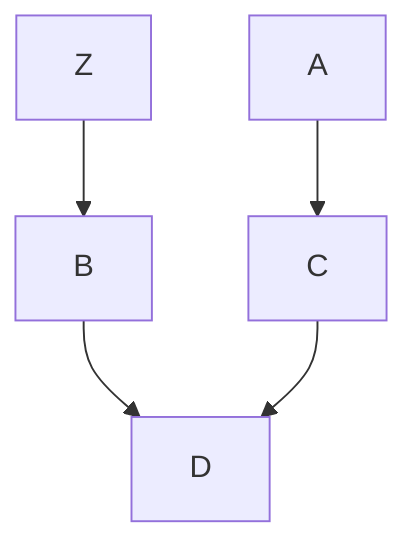
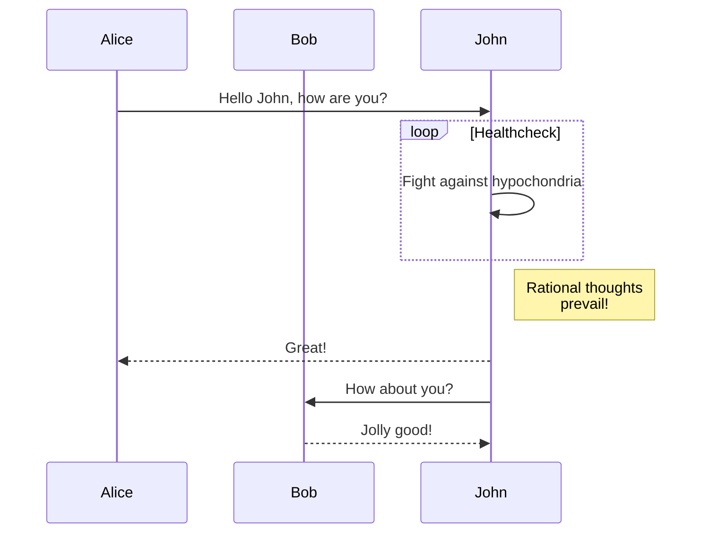
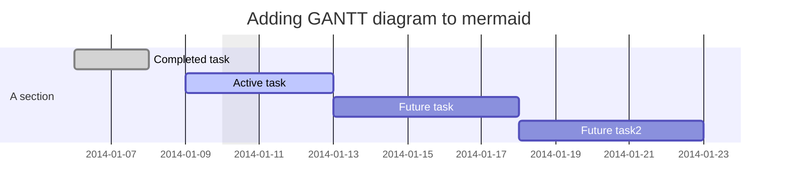
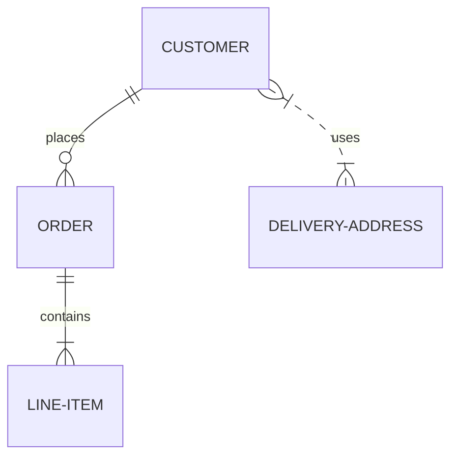
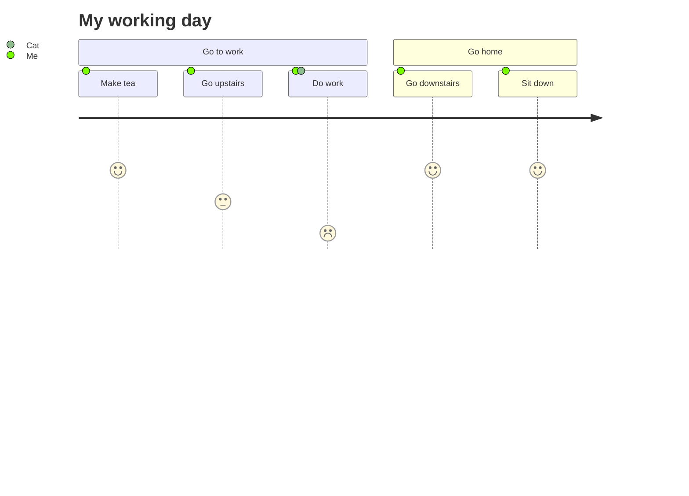

# Diagrams as code

- `brew install graphviz`
- [cloud arh](https://diagrams.mingrammer.com/)
- [C4-PlantUM](https://github.com/plantuml-stdlib/C4-PlantUML)
- [plantuml](https://plantuml.com/en/)
- [asciidoc](https://docs.asciidoctor.org/diagram-extension/latest/#meme)
- [VISUALIZATION GRAMMARS](https://vega.github.io/vega/)
- [vega-lite]([https://vega.github.io/vega-lite/)
- [[meraid](https://mermaid-js.github.io/mermaid/#/)

> [output.html]
> additional-js = ["mermaid.min.js", "mermaid-init.js"]

# configure mermaid output dir

> `$mdbook-mermaid install $Repo_DIR/waxctech.github.io/docs`

